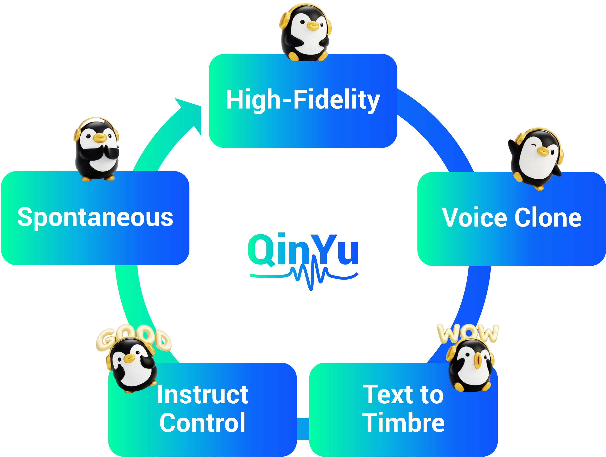

<p align="center">
    
<p>

  
# 👉🏻 QinYu: A Family of High-Fidelity Zero-Shot TTS 👈🏻 
<a href="http://tme-lyra-lab.github.io/" ></a> | <a href="README_zh.md"></a>


## Highlight🔥  
QinYu is a breakthrough high-fidelity text-to-speech (TTS) system that redefines synthetic speech quality with 32kHz studio-grade audio, natural conversational flow, and precise emotional expression—surpassing the 22kHz limit of most open-source TTS systems.  

<p align="center">
    
<p>

## Core Capabilities  

### Basic

- HiFi：32kHz, rich spectral details, high clarity, and good sound quality
- ZeroShot：voice clone using only about 10 seconds of audio.


### Instructed Voice Generation (QinYu-Instruct)  
Supports refined emotional control through natural language descriptions. Natural language descriptions are mainly divided into emotional descriptions and scene descriptions, with the main form being emotional description|scene description|copy.

*Example*:   
- 惊喜、兴奋|意外获得好消息|真的吗？哈哈哈哈，看来我的运气不错！
- 惊喜|意外获得礼物|天哪！我打开盒子一看，竟然是我最想要的那把剑！
- 好奇|对未知事物或秘密的兴趣|你是怎么做到让这个机器运转起来的？快教教我！
- 愤怒、质问|怀疑伴侣不忠时的尖锐质问|你心里难不成还有人？或者，你看上了今日的魏无勋？

### [Text-to-Timbre](https://github.com/TME-Lyra-Lab/DeepDubbing)

Voice timbres can be customized according to character attributes (age, gender, identity, personality) to create unique voice identities for different characters.

*Example*:  
- Child (e.g., "该角色是一个幼儿女性，身份是小郡主/公主，性格骄慢却善良、爱助人，气质高贵带娇憨。")  
- Youth (e.g., "该角色是一个青年女性，身份是医者/药师，性格温婉善良、细腻包容，气质清雅含蓄，音色柔和温暖，语速舒缓")  
- Middle-aged (e.g., "该角色是一个中年女性，身份是丧夫寡妇/孤母，性格忧郁坚韧、撑家计，气质悲苦却倔强")  
- Elderly (e.g., "该角色是一个老年男性，身份是退隐老帝/太上皇，性格深不可测、威势犹存，气质泰山压顶")  
- Non-human (e.g., "该角色是一个非人类树精（中年男性），身份是古木灵/山林守护者，性格沉稳寡言、爱自然，气质古老带绿意")  

### Spontaneous 

For the podcast dialogue scenario, we have implemented the ability for spontaneous colloquial expression (with automatic addition of pauses, hesitations, and moments of thinking) as well as enhanced paralinguistic expression, resulting in a more realistic and human-like effect.T

### BibTeX
```bibtex
@article{qinyu-2025,  
  title={QinYu: A Family of High-Fidelity Zero-Shot TTS with High Naturalness, Spontaneous Colloquialism, and Emotional Control},  
  author={QinYu Team, TME Lyra Lab},  
  year={2025}  
}
```
